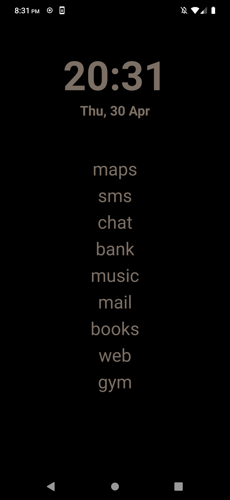
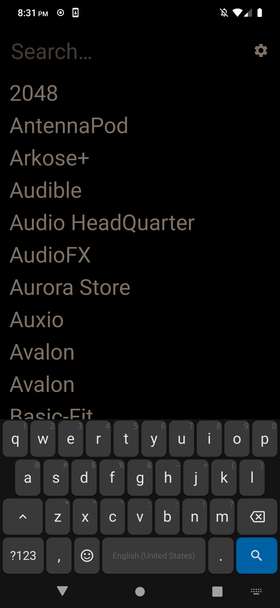
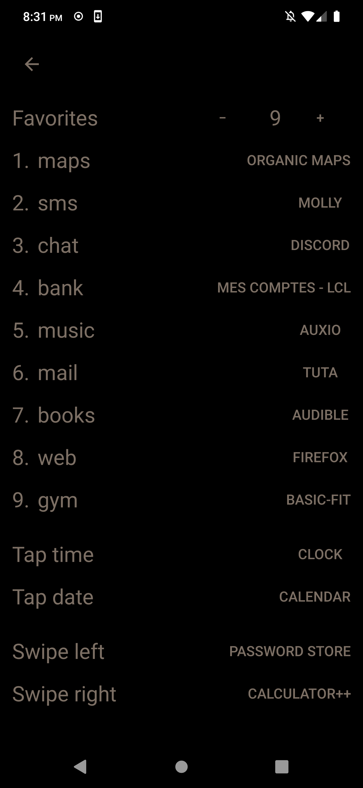

<p align="center">
  
</p>

<h1 align="center">tilde</h1>
<p align="center">A minimal text-only Android launcher.</p>

<p align="center">
  <a href="https://f-droid.org/packages/xyz.chambaz.tilde">
    
  </a>
</p>

<p align="center">
  
  
  
</p>

## About

Tilde replaces the standard Android launcher with three screens navigated by
vertical swipe. The home screen shows the time, date, and a short list of
labeled shortcuts to your most-used apps. Swipe down to open the app drawer,
which filters your installed apps as you type. Swipe up to expand the
notification shade.

From the home screen, tapping the time, tapping the date, swiping left, and
swiping right each launch a configurable app. The settings screen is accessible
from the app drawer.

There are no icons, no widgets, and no wallpapers.

## Build

The project requires JDK 21 and the Android SDK. A Nix flake is provided that
sets up the full environment automatically. Without Nix, set `ANDROID_HOME` and
`JAVA_HOME` manually before building.

```sh
just run      # install and launch on a connected device
just build    # compile a debug APK
just release  # compile a release APK
just test     # run unit tests
```

For wireless ADB pairing:

```sh
just pair <ip> <port> <code>
just connect
```

## License

<a href="https://www.gnu.org/licenses/gpl-3.0.en.html">
  
</a>

Tilde is free software. You can use, study, modify and distribute it under the
terms of the [GNU General Public License](https://www.gnu.org/licenses/gpl-3.0.en.html),
version 3 or later.
